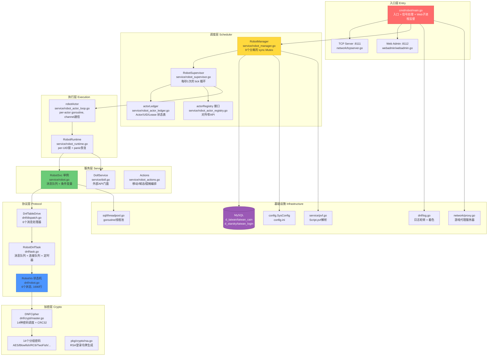
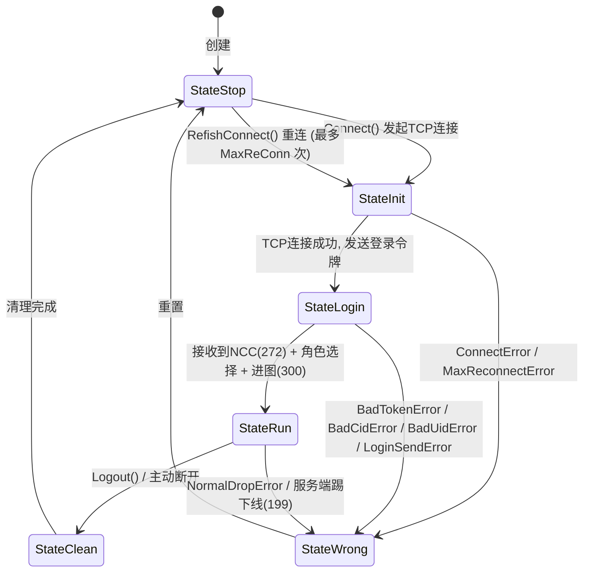
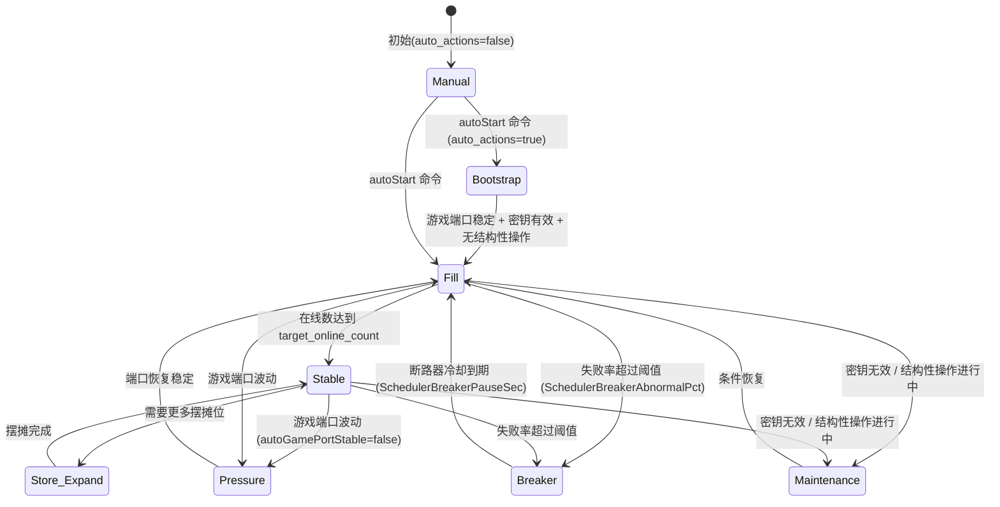
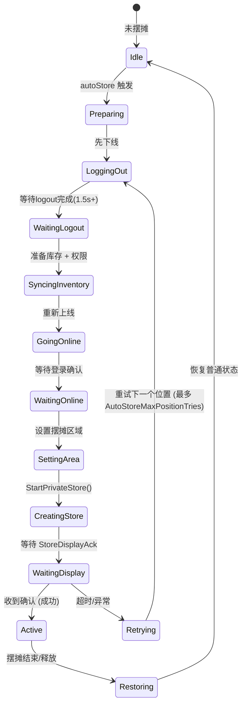

# 代码库知识图谱: clever-river (DNF 机器人管理系统)

## 1. 项目全景

- **技术栈**: 
  - 语言: Go 1.22
  - 数据库: MySQL (d_taiwan / d_starsky / taiwan_cain / taiwan_login 四个 schema)
  - 协议: 自定义 XML TCP 协议 (控制面) + DNF 原生加密协议 (游戏面)
  - 加密体系: 14 种对称分组密码 + RSA + MD5 + CRC32 + RC4 + 自定义流密码
  - 依赖: `github.com/go-sql-driver/mysql v1.8.1`, `golang.org/x/text v0.22.0`
  - 部署: 单二进制文件 (`bin/robot`)，目标平台 Linux amd64

- **核心入口**: 
  - `cmd/robot/main.go:38` — `main()` 函数，启动全部子系统后阻塞等待 OS 信号
  - TCP 控制端口 `8111` — XML 协议的外部控制 API
  - Web 管理端口 `8112` — HTTP 仪表盘 + API 代理
  - `--web-admin` 子进程模式 — 主进程 fork 自身运行 Web 面板

- **架构风格**: 
  - Actor 模型 (goroutine-per-robot)
  - 监督者层级 (Supervisor -> ActorRegistry/Ledger -> Runtime -> RobotVo)
  - 生产者-消费者消息队列
  - 单例服务 (RobotSvc)
  - 嵌入资源 (embed.FS)

## 2. 架构分层与模块拓扑



- **分层说明**: 
  | 层 | 目录 | 职责 |
  |---|---|---|
  | 入口层 | `cmd/robot/` | 启动/关闭编排，TCP命令路由，Web子进程监护 |
  | 调度层 | `internal/service/robot_auto_*.go`, `robot_manager.go`, `robot_supervisor.go` | 自动调度决策，断路器，租约管理，指标聚合 |
  | 执行层 | `internal/service/robot_actor_*.go`, `robot_runtime.go` | Per-actor goroutine，per-UID互斥执行，panic隔离 |
  | 服务层 | `internal/service/robot*.go`, `doll.go` | 外部API门面，动作编排，状态报告 |
  | 协议层 | `internal/dnf/` | DNF消息路由，机器人状态机，连接管理 |
  | 加密层 | `internal/dnf/crypt/`, `pkg/crypto/` | 14种分组密码，RSA令牌，登录流解密 |
  | 基础设施 | `internal/sql/`, `internal/network/`, `internal/config/`, `internal/webadmin/` | 数据库连接池，TCP/代理服务器，配置，Web面板 |

- **核心模块职责**: 
  - `RobotManager`: 中央协调器，持有所有共享状态和9个粒度互斥锁
  - `RobotSupervisor`: 自动调度"大脑"，每秒执行6步调度管线
  - `actorLedger`: 监督者拥有的 Actor/UID/Lease 真实状态表
  - `RobotRuntime`: Per-UID 引用计数锁池 + panic隔离
  - `RobotSvc`: 单例消息队列服务，生产者-消费者模式
  - `RobotVo`: 单机器人 TCP 连接状态机 (6状态)
  - `RobotDnfTask`: 消息队列(5000容量) + 连接队列(35ms节流) + 定时器队列(10000容量)

## 3. 核心状态机与数据流转

### 3.1 机器人生命周期状态机



### 3.2 自动调度策略状态机



### 3.3 摆摊操作状态机



- **核心状态表**: 
  | Schema | 表名 | 用途 | 关键字段 |
  |---|---|---|---|
  | `d_taiwan` | `accounts` | 账号主表 | `UID` (AUTO_INCREMENT), `accountname` |
  | `taiwan_cain` | `charac_info` | 角色信息 | `charac_no` (CID), `m_id` (UID), `village`, `lev` |
  | `taiwan_cain` | `charac_stat` | 角色属性 | `EXP`, `village` |
  | `taiwan_login` | `login_account_3` | 登录状态 | `m_id`, `login_ip` |
  | `taiwan_login` | `member_login` | 登录会话 | `m_id`, `conn_ip`, `last_play_time` |
  | `d_starsky` | `Dummylist` | 机器人注册表 | `UID`, `CID`, `area`, `x`, `y`, `function_type`(0=普通,2=摆摊) |
  | `d_starsky` | `robot_registry` | 机器人注册(新版) | `UID`, `CID`, `created_at` |
  | `d_starsky` | `Robot_stall` | 摆摊库存 | `CID`, `stall`, `doll_info` |
  | `d_starsky` | `Robot_stall_config` | 摆摊配置 | `CID`, `items` |
  | `d_taiwan` | `member_premium` | 摆摊权限 | `m_id`, `pre_type=8`, `event_id=50002` |
  | `d_taiwan` | `member_punish_info` | 处罚记录 | `m_id`, `punish_type=11` (交易处罚) |

- **缓存策略**: 
  - **无 Redis** — 本项目没有使用 Redis。所有缓存均为进程内内存缓存。
  - 列元数据缓存 (`cacheMu`): `SHOW COLUMNS` 结果缓存，LRU 100条目驱逐
  - 运行时状态缓存 (`runtimeStatusMu`): 所有机器人的最新状态快照，由 Actor 定时刷新
  - 配置懒缓存: `robot_config.ini` 按需加载，通过写入时间戳判断是否需要刷新
  - 摆摊点位缓存: `store_points_cache.json` 文件持久化，含MD5校验
  - PVF导出缓存: `pvf_manifest.json` 版本号+MD5校验，避免重复解析

## 4. 并发控制与一致性

### 4.1 锁机制清单

| 位置 | 类型 | 粒度 | 保护对象 |
|---|---|---|---|
| `robot_manager.go:26` | `sync.Mutex` | 通用 | RobotManager 杂项字段 |
| `robot_manager.go:27` | `sync.Mutex` | 结构性操作级 | 批量创建/清理 (lifecycleMu) |
| `robot_manager.go:28` | `sync.Mutex` | 调度器级 | 自动调度共享状态 (autoMu) |
| `robot_manager.go:29` | `sync.Mutex` | 缓存级 | 运行时状态缓存 (runtimeStatusMu) |
| `robot_manager.go:30` | `sync.Mutex` | 缓存级 | 列/schema 元数据缓存 (cacheMu) |
| `robot_manager.go:31` | `sync.Mutex` | 工具级 | 随机数生成器 (randMu) |
| `robot_manager.go:32` | `sync.Mutex` | 资源池级 | 摆摊槽位信号量 (storeSlotMu) |
| `robot_manager.go:33` | `sync.Mutex` | 操作记录级 | 操作追踪 (operationMu) |
| `robot_manager.go:34` | `sync.Mutex` | 操作记录级 | 清理待处理 UID 列表 (cleanupMu) |
| `robot_actor.go` | `sync.Mutex` | Actor 级 | 单个 Actor 的状态字段 |
| `robot_runtime.go` | `sync.Mutex`(池) | UID 级 | Per-UID 互斥执行 (引用计数池) |
| `robot_actor_ledger.go` | `sync.Mutex` | 账本级 | Actors/Leases/Blocks 核心状态表 |
| `robot_store_points.go` | `sync.Mutex` | 协调器级 | 摆摊点位网格协调器 |
| `robot.go` | `sync.Mutex` + `sync.Cond` | 服务级 | RobotSvc 消息队列 |
| `dnf/robot.go:117` | `sync.Mutex` | VO 级 | RobotVo 全部60+状态字段 |
| `dnf/robot.go:118` | `sync.Mutex` | 写通道级 | Socket 写入互斥 (sendMu) |
| `dnf/task.go` | `sync.Mutex` + `sync.Cond` | 队列级 | 消息队列 (messageMutex) |
| `dnf/task.go` | `sync.Mutex` | 队列级 | 定时器队列 (timerMutex) |
| `dnf/task.go` | `sync.Mutex` | 表级 | 消息处理器路由表 (keyToHandleMu) |
| `dnf/task.go` | `sync.Mutex` | 去重级 | 连接队列去重 (connectMu) |
| `dnf/task.go` | `sync.RWMutex` | VO 注册表 | 机器人VO映射表 (robotVoMutex) |
| `dnf/log.go` | `sync.Mutex` | 文件级 | 日志写入 |
| `network/tcpserver.go` | `sync.RWMutex` | 连接表 | 客户端映射表 (clientsMu) |
| `network/proxy.go` | `sync.Mutex` | 连接级 | 代理服务器连接 (serverConnMu) |
| `network/proxy.go` | `sync.Mutex` | 心跳级 | 心跳计数器 (beatCountMu) |
| `webadmin/webadmin.go` | `sync.RWMutex` | 会话级 | Token 会话表 (tokenMu) |
| `sql/threadpool.go` | `sync.Mutex` | 池级 | 线程池状态 |

**总计**: 26个 `sync.Mutex` + 3个 `sync.RWMutex` + 3个 `sync.WaitGroup` + 7个 `sync.Once` + 2个 `sync.Cond` + 28+ channel + 2个 `atomic.Bool` + 1个 `sync.Map`

**锁层级关系 (从上到下)**:
```
lifecycleMu (结构性操作: 创建/清理)
  └── autoMu (自动调度器状态)
       └── actorLedger.mu (账本核心状态)
            └── robotActor.mu (单个Actor)
                 └── runtimeUIDLock.mu (Per-UID)
                      └── RobotVo.mu (网络状态机)
                           └── RobotVo.sendMu (Socket写)
```

### 4.2 幂等设计

| 业务操作 | 幂等机制 | 实现位置 |
|---|---|---|
| **异步操作去重** | `sync.Map.LoadOrStore` — 同名异步操作同时只能有一个运行 | `main.go:queueRobotAction()` |
| **机器人登录** | `INSERT IGNORE` — 10+ 个表的修复SQL均使用 IGNORE/UPSERT | `handler_online.go:repairLoginPrerequisites()` |
| **连接队列去重** | `connectQueued map[int]bool` — 同一UID在连接队列中只允许出现一次 | `task.go:connectLoop()` |
| **结构性操作互斥** | `beginStructuralOp()` / `beginActorContainerOp()` — 返回清理函数，嵌套安全，10分钟自动过期 | `robot_manager.go` |
| **Per-UID互斥** | 引用计数锁池 — 同一UID不能并发执行操作 | `robot_runtime.go:acquireUIDLock()` |
| **摆摊去重** | `beginStoreBusy(uid)` / `endStoreBusy(uid)` — Per-UID 摆摊忙锁 | `robot_store_busy.go` |
| **摆摊槽位信号量** | Buffered channel `chan struct{}{SchedulerStoreConcurrent}` | `robot_store_auto.go` |
| **关闭幂等** | `sync.Once` 保护所有 `Close()/Stop()/Shutdown()` 方法 | 7 个组件 |
| **TCP服务器关闭** | `atomic.Bool.Swap(false)` 确保单次关闭 | `tcpserver.go` |
| **配置写入** | 先读取现有内容 → 按行修改 → 原子写入 (非直接覆盖) | `robot_config_api.go` |

## 5. 核心功能实现解剖

### 功能 A: 机器人批量上线 (Online)

- **调用链路**: 
  ```
  TCP命令 (robotsOnline/robotsOnlineAsync)
    → main.go:handlePacket() [panic recover保护]
    → main.go:queueRobotAction() [sync.Map去重]
    → RobotManager.Online() [密钥有效性检查]
    → DollService.MsgOnLine() [生成RSA登录令牌]
    → RobotSvc.PushRobotMsg() → DnfTableDrive.handleOnLine()
    → repairLoginPrerequisites() [10+条SQL修复]
    → RobotDnfTask.dnfMsgOnLine() [创建RobotVo]
    → connectLoop() [35ms节流的连接队列]
    → RobotVo.Connect() [TCP连接 + 登录协议]
    → RobotVo.readLoop() [解密 + 解析 + 状态机驱动]
  ```

- **设计模式**: 
  - **门面模式**: DollService 作为内部实现的统一对外接口
  - **生产者-消费者**: `sync.Cond` + 消息队列
  - **节流器**: `time.Ticker(35ms)` 控制连接速率
  - **策略模式**: 14种密码通过 `BlockCipher` 接口统一调用

- **关键代码逻辑**: 
  - 上线前必须为每个UID生成RSA登录令牌 (46字节二进制结构: UID的 LE uint32 + ASCII UID字符串 + 时间戳 + 魔数 `0x010403030101`)
  - 数据库修复确保 `member_login`、`login_account_3` 等8+张表存在对应行
  - 自动修复经验值边界 (通过 `exp_level_ref` 表或硬编码等级表)

### 功能 B: 自动调度循环 (Auto Scheduler)

- **调用链路**: 
  ```
  每秒 Tick (time.Ticker, 1s)
    → RobotSupervisor.tick(now)
    → 步骤1: handleAutoGuards() [检查条件]
         ├─ 检查 auto_actions 是否启用
         ├─ 检查密钥是否有效 (keypairStatus.KeyState == "valid")
         ├─ 检查是否有结构性操作进行中
         ├─ 检查游戏端口是否稳定 (autoGamePortStable())
         └─ 检查断路器是否激活
    → 步骤2: maintainTarget() [维护目标Actor数]
    → 步骤3: releaseBrokenLeases() [清理僵尸租约]
    → 步骤4: cleanupBlockedUIDs(10) [清理阻塞的UID]
    → 步骤5: recycleUnhealthyActors() [回收不健康的Actor]
    → 步骤6: assignIdleAutoActors() / updateMetrics() [分配新任务+上报指标]
  ```

- **设计模式**: 
  - **监督者模式**: Supervisor 监控并重启失败 Actor
  - **断路器模式**: 失败率超过阈值暂停调度，冷却后自动恢复
  - **租约模式**: UID 通过 `actorLedger` 租约绑定到 Actor

- **关键指标 (单行日志)**: `[RobotMetrics]` 包含 30+ 字段:
  `auto_enabled, policy_mode, actors, auto_actors, leased, running, online, store_active, failed_rate, breaker_active, ...`

### 功能 C: 自动摆摊 (Auto Store)

- **调用链路**: 
  ```
  Actor.tick() [检测到 idle 且可摆摊]
    → robot_store_auto.go:autoStoreUntilSuccess()
    → 获取全局槽位信号量 (SchedulerStoreConcurrent, 默认30)
    → 从摆摊点位网格中 claim 一个点位
    → tryAutoStorePosition():
        1. Logout (断开连接)
        2. 等待 1.5s+
        3. 准备库存 (从PVF目录选材) + 权限 (INSERT 5张表)
        4. Online (重新连接)
        5. 等待登录确认 (OnlineConfirmTimeoutMS)
        6. SetArea (传送到摆摊区域)
        7. StartPrivateStore (发起摆摊)
        8. 等待 StoreDisplayAck (最多 10s, 带 2s间隔主动完成回退)
    → 成功 → report 点位成功
    → 失败 → 重试下一个点位 (最多 AutoStoreMaxPositionTries 次)
         ├─ 错误码 0x52 → 标记周边区域 restrictive_zone_locked
         └─ 其他错误 → 标记点位 failed, 6分钟后可重试
    → 释放槽位信号量
  ```

- **设计模式**: 
  - **重试模式**: 多级重试 (点位级 + 步骤级)
  - **信号量模式**: Buffered channel 限流并发摆摊数
  - **空间哈希**: 摆摊点位网格 (X步长120, Y步长80)，以区域(180x120)为单位进行冲突管理

### 功能 D: 批量数据清理 (Cleanup)

- **调用链路**: 
  ```
  TCP命令 (cleanupRobots/cleanupRobotsAsync)
    → RobotManager.CleanupRobots()
    → 获取 lifecycleMu (结构性操作锁)
    → beginStructuralOp() [结构性操作令牌, 10分钟自动过期]
    → cleanupCandidates() [查询候选机器人]
    → 保护检查: accountname 必须匹配 UID 格式要求
    → stopUIDs() [通过 actorRegistry 停止相关Actor]
    → batchDeleteRobotData() [事务性批量删除]
         ├─ 每个批次 ≤ 500 条
         ├─ 涉及的 UID 表 (17张)
         ├─ 涉及的 CID 表 (11张)
         └─ 涉及的账户字符串表 (2张)
    → 共计 30+ 张表的级联清理
  ```

- **设计模式**: 
  - **事务批处理**: 500条/批的单事务删除
  - **保护性校验**: accountname 格式校验防止误删
  - **结构性操作令牌**: 阻止清理期间启动自动调度

### 功能 E: 登录令牌生成与加密认证

- **调用链路**: 
  ```
  DollService.MsgOnLine()
    → helper.go:GetLoginKey(uid)
        → BuildLoginKeyPlainHex(uid) [构造16进制字符串]
        → rsa.SignPKCS1v15(nil, privateKey, 0, hexBuff) [RSA签名]
        → base64编码
    → 令牌注入到上线请求
    → RobotVo.Connect() → TCP发送登录包
    → 游戏服务器验证令牌
    → RobotVo.readLoop() 接收响应:
        ├─ 包类型272(NCC) → 发送NCC响应 + 选角
        ├─ 包类型1(加密登录) → DNFCipher.Initialize(密钥) + 发送登录令牌
        ├─ 包类型53 → 发送选角确认
        └─ 包类型300 → 设置位置 + StateLogin→StateRun
  ```

- **设计模式**: 
  - **多密码调度**: `packetType % 14` 选择密码算法
  - **自定义流密码**: 登录流使用 `rotation+XOR` 解密 (魔数 71646901)

## 6. 防护与容灾机制

### 6.1 限流/熔断

| 机制 | 位置 | 策略 |
|---|---|---|
| **断路器** | `robot_manager.go` + `robot_auto_scheduler.go` | 当各操作失败率超过 `SchedulerBreakerAbnormalPct` 时激活；释放 `SchedulerBreakerReleaseBatch` 个 Actor；保留 `SchedulerBreakerFloorPct` 比例的运行数；持续 `SchedulerBreakerPauseSec` 秒后自动恢复 |
| **连接节流** | `dnf/task.go:connectLoop()` | 35ms 间隔逐个发起连接，连接队列容量 5000 |
| **消息队列入队限流** | `robot.go:PushRobotMsg()` | 队列容量 10000，满时返回 `"queue_full"` |
| **定时器队列入队限流** | `dnf/task.go` | 容量 10000，满时丢弃最旧条目 |
| **Per-IP 连接限制** | `network/tcpserver.go` | `maxPendingPerIP` 限制 (默认512)，未注册连接 5s 超时 |
| **摆摊并发限流** | `robot_store_auto.go` | Buffered channel 信号量 (默认容量30) |
| **HTTP Body 限流** | `webadmin.go` | API 调用 body 限制 2MB |
| **HTTP 超时** | `webadmin.go` | ReadHeader=5s, Read=15s, Write=30s, Idle=60s |
| **DB连接池** | `config.go` | 初始化大小 + 最大大小 + 连接超时可配置 |
| **日志轮转** | `dnf/log.go` | 100MB 触发轮转，保留 5 个备份 |

### 6.2 安全防护

| 机制 | 位置 | 实现 |
|---|---|---|
| **Web认证** | `webadmin.go` | Cookie + Token (12h有效期+续期)，`subtle.ConstantTimeCompare` 防时序攻击 |
| **命令认证** | `main.go` | 敏感命令 (`createRobots`, `robotsOnline`, `autoStart` 等) 先通过 `requireValidKeypair()` 校验 |
| **密钥对验证** | `service/keypair.go` | RSA签名/验签 round-trip 验证，SHA-256指纹校验 |
| **密钥对自愈** | `service/keypair.go` | 如果只存在私钥，自动派生公钥；密钥无效可释放嵌入式默认密钥 |
| **RSA令牌** | `pkg/crypto/rsa.go` | 46字节二进制令牌含UID+时间戳+魔数，RSA私钥加密(非PKCS!原始RSA) |
| **数据行级校验** | `robot_cleanup.go` | 清理时校验 `accountname == fmt.Sprintf("%d", uid)` 防止误删 |
| **SQL注入防护** | 全局 | 全部使用参数化查询 (`?` 占位符)，无字符串拼接SQL |
| **Panic恢复** | 7处 | `handlePacket()`, `withDiagnostics()`, `readLoop()`, `run()`, `executeAsyncTasks()`, `StartPrivateStore()`, 消息分发 |

### 6.3 异常兜底

| 场景 | 兜底策略 |
|---|---|
| **机器人连接失败** | 重连机制 (最多 `MaxReConn` 次)，`RefishConnect()` 创建新VO并继承状态 |
| **游戏端口不可用** | `autoGamePortStable()` 检测，端口必须连续稳定 `auto_game_port_stable_sec` 秒才允许调度 |
| **密钥无效** | 调度器自动进入 Maintenance 模式；可通过 Web 面板下载新密钥或释放默认密钥 |
| **摆摊显示超时** | `CompletePrivateStoreDisplay` 每2秒主动触发一次落回 (最多4次)，10秒总超时 |
| **僵尸租约** | `releaseBrokenLeases()` 定时检测，清理数据库中不存在的UID租约 |
| **Actor 不健康** | `recycleUnhealthyActors()` 定时检测，回收 `RecycleUID` 标记的Actor |
| **结构性操作超时** | `beginStructuralOp()` 返回的令牌在10分钟后自动失效 |
| **Web子进程崩溃** | 主进程 `startWebAdminSupervisor()` 检测退出，2秒后自动重启 |
| **日志文件** | 轮转 (100MB→.1→.2→...最多5个)，写入失败不影响业务 |
| **全局异常** | `main()` 中 `defer dnf.LogClose()` / `defer robotSvc.Shutdown()` 保证资源释放 |

## 7. 盲区与风险预警

### ⚠️ 潜在竞态条件

1. **`dnf/robot.go:966` — executeAsyncTasks 中的 VO 状态竞态**
   - `executeAsyncTasks()` 在独立 goroutine 中运行，通过 `Controller.AddMessageDelay()` 重新调度自身，但在此期间 VO 可能已被其他 goroutine 修改状态。虽然有 `vo.mu` 保护，但延迟消息中的状态引用可能已过期。

2. **`robot_actor_leases.go` — 租约与数据库之间的检查-执行间隙**
   - `releaseBrokenLeases()` 先获取所有租约快照，再逐个查询数据库。在快照到查询之间，数据库可能已被其他操作修改，导致误判或漏判。

3. **`main.go:queueRobotAction()` — asyncActions 去重的 ABA 问题**
   - 使用 `sync.Map.LoadOrStore` 进行去重，但值类型为 `bool`。如果异步操作瞬间完成并被删除，下一个同名操作可能错误地执行而不是去重。

4. **`robot_cleanup.go` — 清理与自动调度之间的 TOCTOU**
   - 清理操作获取 `lifecycleMu` + 结构性操作令牌，这阻止了调度器创建新Actor，但已经运行的Actor可能仍在操作被清理的UID。`stopUIDs()` 通过 `actorRegistry` 尝试停止，但存在时间窗口。

### ⚠️ 隐性代码约定

1. **必须先调用 `InitRuntime()` 再使用 `RobotManager`**
   - 密钥对文件在 `InitRuntime()` 中从游戏目录同步到配置目录，如果跳过此步骤，`EnsureRuntimeKeypair()` 会失败，导致所有需要认证的操作不可用。

2. **`RobotRuntime.run()` 的嵌套调用约定**
   - `acquireUIDLock()` 使用引用计数支持嵌套调用。但调用者必须保证 `acquire` 和 `release` 严格配对，否则锁泄漏且永不释放。当前所有调用点都在 `run()` 的 defer 中 release — 但没有任何编译时或运行时检查强制此约定。

3. **PVF 文件必须在游戏目录存在且可读**
   - 装备/消耗品目录、地图数据全部来自 `Script.pvf` 的解析。如果 PVF 损坏或版本不匹配，`pvf_manifest.json` 的 MD5 校验会阻止加载，但不会给出恢复路径 — 用户必须手动删除 manifest 文件。

4. **`config.ini` 中 section/key 名称的二义性**
   - `robot_config_api.go:updateINIText()` 按行解析 INI，通过 `strings.HasPrefix` 匹配 section。如果注释中包含 `[keyword]` 模式，会被误当作 section 处理。

5. **RSA 密钥的两个不同 API 路径并存**
   - `pkg/crypto/rsa.go:GetLoginKey()` 使用**原始 RSA 加密** (textbook RSA, 无padding)
   - `internal/service/helper.go:GetLoginKey()` 使用 **PKCS1v15 Sign**
   - 两者共存且功能重叠，代码注释和命名未明确区分，容易误用

6. **摆摊点位网格的区域锁定是单向的**
   - 一旦区域因 `0x52` 错误被标记为 `restrictive_zone_locked`，不会自动解锁。只能手动删除 `store_points_cache.json` 文件重置。

### ⚠️ 架构单点与脆弱点

1. **`RobotSvc` 单例 — 消息处理的单点瓶颈**
   - `robot.go:run()` 中的消息分发循环是串行的（一条一条处理）。如果某个消息处理阻塞（例如数据库查询卡住），后续所有消息都会排队。消息队列容量 10000，但处理速度受限于最慢的消息。

2. **`RobotDnfTask` 三个 goroutine 的协调脆弱性**
   - `dispatchLoop()` 通过条件变量等待消息，`connectLoop()` 通过 ticker 驱动。如果 `dispatchLoop` 因为 panic 恢复而跳过某个消息，该消息永久丢失且无告警。

3. **`RobotManager` 的 9 个互斥锁 — 潜在死锁**
   - 虽然有锁层级约定（lifecycleMu → autoMu → ledger.mu → actor.mu → runtimeLock → vo.mu → sendMu），但没有死锁检测机制。违反层级约定会导致死锁，目前仅靠开发者纪律保证。

4. **数据库单点依赖**
   - 整个系统强依赖 MySQL。数据库不可用时：机器人无法上线、调度器进入 `Maintenance`、所有操作返回错误。没有降级到只读模式或缓存的容灾设计。

5. **`actorRegistry` 接口的不完整抽象**
   - `actorRegistry` 旨在对外提供窄API，但 `RobotManager.StopUIDs()` 在 registry 返回 nil 时会回退到直接使用 `doll.MsgLogout()` — 这绕过了 registry 的租约/账本跟踪，可能导致租约泄漏。

6. **Web子进程的无限重启**
   - `startWebAdminSupervisor()` 在子进程退出后 2秒自动重启。如果子进程因配置错误反复崩溃，将陷入无限重启循环 (fork bomb risk)。没有退避算法或最大重启次数限制。

7. **TPC 服务器未注册连接的超时**
   - 未注册连接的超时 (5s) 比已注册连接 (90s) 短，但如果大量客户端持续发起连接但不发送首包，`pendingByIP` 限制可能会影响合法客户端（512个/ip上限）。

8. **日志文件轮转时的消息丢失风险**
   - `rotateLogIfNeededLocked()` 在持有 `logMu` 时执行文件重命名和重新打开，期间所有日志写入被阻塞。虽然操作通常很快，但在极端情况下（磁盘I/O卡顿）可能导致日志写入延迟。

9. **`RobotRuntime` 的锁池无上限**
   - `runtimeUIDLock` 池在 `acquireUIDLock()` 中动态创建，`releaseUIDLock()` 中引用计数归零时删除。但在高并发下，如果有大量不同 UID 同时操作，锁池会膨胀。虽然有 GC 机制，但瞬间内存占用可能较高。

10. **PVF 解析性能风险**
    - `ensurePVFExports()` 在首次启动时解析整个 Script.pvf (DNF 游戏资源包通常数百MB)，并将结果导出为 JSON。如果是大型PVF，这个过程可能耗时数分钟，期间系统虽可接受命令但缺少装备/地图数据。
